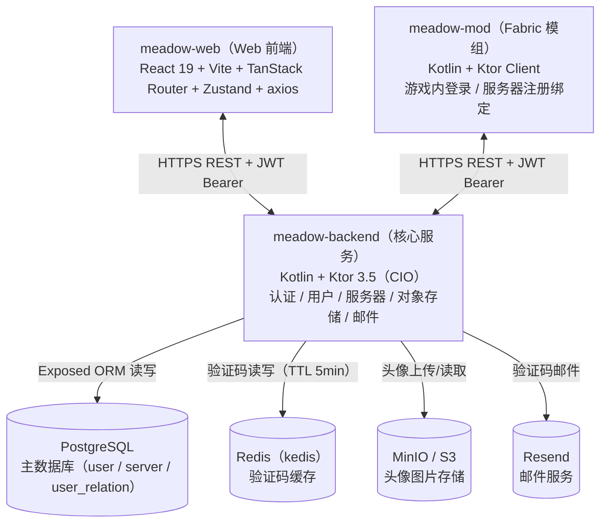
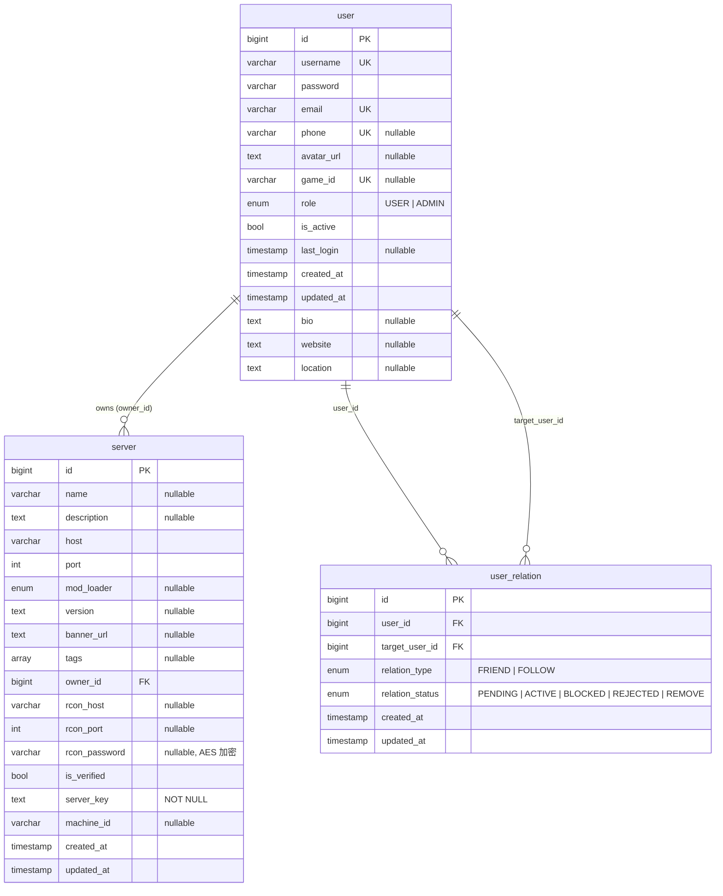
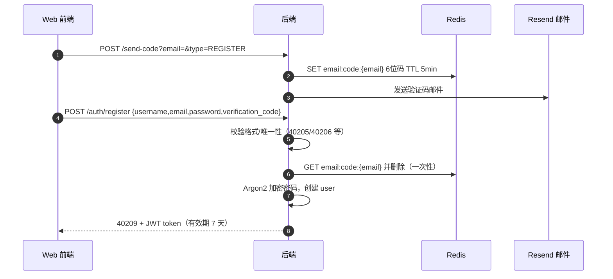
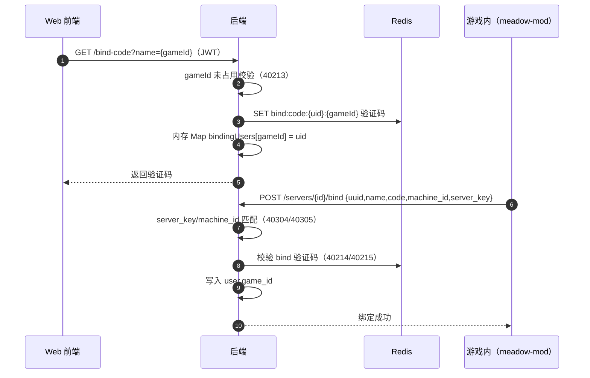
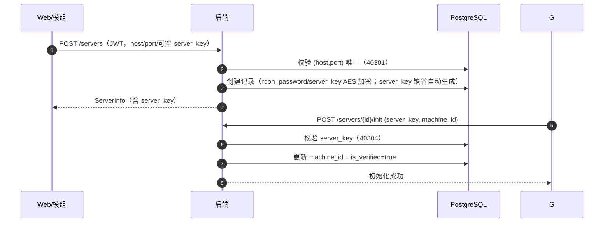

# 系统设计文档 —— Meadow

> **说明**：本文档以 `meadow-backend`（Ktor 后端）实际代码为准重写，逐条对照 `routing/`、`service/`、`database/`、`security/`、
> `plugins/` 与 `application.yaml`。
> 文中标注 **[已实现]** 的内容与代码一致；标注 **[规划中]** 的内容为前瞻设计（尚未实现）；标注 **[TODO]** 的内容在代码中存在占位但未完成。
> 三个仓库：`meadow-web`（Web 前端）、`meadow-backend`（后端）、`meadow-mod`（Minecraft Fabric 模组）。

---

## 1. 系统概览

### 1.1 整体架构



### 1.2 三端职责 [已实现]

| 端       | 仓库             | 技术栈                                                                                      | 职责                                                                                        |
|:---------|:-----------------|:--------------------------------------------------------------------------------------------|:--------------------------------------------------------------------------------------------|
| Web 前端 | `meadow-web`     | React 19 + Vite 8 + TypeScript + Tailwind v4 + TanStack Router + Zustand + sonner + axios   | 用户注册/登录、个人中心、服务器浏览（当前服务器/个人中心数据为前端 mock，待后端实现后对接） |
| 后端     | `meadow-backend` | Kotlin 2.4 + Ktor 3.5（CIO）+ Exposed 1.3 + PostgreSQL + Redis(kedis) + AWS S3 SDK + Resend | 认证（注册/登录/验证码）、用户信息、服务器注册/绑定/初始化/CRUD、头像存储、邮件发送         |
| 游戏模组 | `meadow-mod`     | Fabric + Kotlin + Ktor Client                                                               | 游戏内 `/meadow` 指令：密码/验证码登录、请求登录验证码、服务器注册/初始化/绑定              |

### 1.3 后端技术栈明细 [已实现]

| 分类          | 选型                                                                                       | 版本                            |
|:--------------|:-------------------------------------------------------------------------------------------|:--------------------------------|
| 语言 / 运行时 | Kotlin（jvmToolchain 21）、Java 21                                                         | Kotlin 2.4.0                    |
| Web 框架      | Ktor Server（CIO 引擎）                                                                    | 3.5.1                           |
| ORM           | Exposed                                                                                    | 1.3.0                           |
| 数据库        | PostgreSQL（主）、H2（测试）                                                               | PostgreSQL 42.7.11 / H2 2.4.240 |
| 缓存          | Redis（kedis 客户端）                                                                      | kedis 0.0.13                    |
| 密码哈希      | Argon2（argon2-jvm）                                                                       | 2.12                            |
| 对象存储      | AWS S3 SDK（Kotlin）                                                                       | 1.6.106                         |
| 邮件          | Resend Java SDK                                                                            | v4.17.0                         |
| 日志          | Logback                                                                                    | 1.5.35                          |
| 其他          | kotlinx.serialization、Ktor Auth/JWT、RateLimit、SSE、WebSockets、Swagger/OpenAPI、Koin DI | Koin 4.2.2                      |

### 1.4 部署与配置 [已实现]

- **入口**：`io.ktor.server.cio.EngineMain`，端口 **23333**（`application.yaml`）。
- **配置加载**：Ktor HOCON 配置（`application.yaml`），模块注册顺序见 `plugins/`：DI → Security → CORS → Monitoring →
  RateLimit → Routing → Serialization → Sockets → StatusPages。
- **数据库选择逻辑（注意）**：DI 中 `ktor.development == true` 时选择 `database.test`（H2 文件库），否则 `database.main`
  （PostgreSQL）——即 **开发模式默认连 H2**，与直觉相反。
- **自动建表**：启动时 `SchemaUtils.create(UserTable, UserRelationTable, ServerTable)`（仅建缺失表，不迁移）。
- **对象存储**：AWS S3 SDK（Kotlin），`region = "us-east-1"`，endpoint 为 `http://{s3.host}:{s3.port}`（自建 MinIO 风格，非 AWS
  公有云），凭据来自 `s3.access_key/secret_key`；当前仅用于头像（bucket `avatar`）。

---

## 2. 数据库设计 [已实现]

### 2.1 ER 图



### 2.2 表定义

#### 2.2.1 `user`（用户表）

| 列名                           | 类型         | 约束             | 说明                                      |
|:-------------------------------|:-------------|:-----------------|:------------------------------------------|
| `id`                           | BIGINT       | PK（自增）       | 用户 ID                                   |
| `username`                     | VARCHAR(32)  | UNIQUE           | 登录用户名                                |
| `password`                     | VARCHAR(128) | NOT NULL         | **Argon2** 哈希后的密码                   |
| `email`                        | VARCHAR(254) | UNIQUE           | 邮箱（用于验证码登录/找回）               |
| `phone`                        | VARCHAR(16)  | UNIQUE, nullable | 手机号（可选）                            |
| `avatar_url`                   | TEXT         | nullable         | 头像 URL                                  |
| `game_id`                      | VARCHAR(64)  | UNIQUE, nullable | 游戏内 ID（注册时不写入，需通过绑定流程） |
| `role`                         | ENUM         | default `USER`   | `USER` / `ADMIN`（系统角色）              |
| `is_active`                    | BOOLEAN      | default `true`   | 账号是否启用                              |
| `last_login`                   | TIMESTAMP    | nullable         | 最后登录时间                              |
| `created_at` / `updated_at`    | TIMESTAMP    | NOT NULL         | 创建/更新时间                             |
| `bio` / `website` / `location` | TEXT         | nullable         | 个人简介/主页/所在地                      |

#### 2.2.2 `server`（服务器表）

| 列名                        | 类型                   | 约束                       | 说明                                                                            |
|:----------------------------|:-----------------------|:---------------------------|:--------------------------------------------------------------------------------|
| `id`                        | BIGINT                 | PK（自增）                 | 服务器 ID                                                                       |
| `name`                      | VARCHAR(255)           | nullable                   | 显示名称                                                                        |
| `description`               | TEXT                   | nullable                   | 描述                                                                            |
| `host`                      | VARCHAR(255)           | NOT NULL                   | 服务器 IP/域名                                                                  |
| `port`                      | INTEGER                | NOT NULL                   | 端口                                                                            |
| `mod_loader`                | ENUM                   | nullable                   | `VANILLA` / `FABRIC` / `NEO_FORGE` / `FORGE`                                    |
| `version`                   | TEXT                   | nullable                   | 游戏版本                                                                        |
| `banner_url`                | TEXT                   | nullable                   | 头图 URL                                                                        |
| `tags`                      | STRING ARRAY           | nullable                   | 标签数组                                                                        |
| `owner_id`                  | BIGINT                 | FK → `user.id`             | 所有者（冗余字段，当前无 `server_members` 表）                                  |
| `rcon_host` / `rcon_port`   | VARCHAR(255) / INTEGER | nullable                   | RCON 连接信息                                                                   |
| `rcon_password`             | VARCHAR(255)           | nullable, **AES 加密存储** | RCON 密码                                                                       |
| `is_verified`               | BOOLEAN                | default `false`            | 是否通过所有权验证（`/init` 后置 true）                                         |
| `server_key`                | TEXT                   | **NOT NULL**               | 服务器 Agent 验证密钥（注册时未提供则自动生成 16 字节 nonce；**AES 加密存储**） |
| `machine_id`                | VARCHAR(255)           | nullable                   | 机器标识（`/init` 时上报）                                                      |
| `created_at` / `updated_at` | TIMESTAMP              | NOT NULL                   | 创建/更新时间                                                                   |

**唯一约束**：`(host, port)`。

#### 2.2.3 `user_relation`（用户关系表）

| 列名                        | 类型      | 约束                                     | 说明                                                     |
|:----------------------------|:----------|:-----------------------------------------|:---------------------------------------------------------|
| `id`                        | BIGINT    | PK（自增）                               | 关系 ID                                                  |
| `user_id`                   | BIGINT    | FK → `user.id`，ON DELETE/UPDATE CASCADE | 发起方                                                   |
| `target_user_id`            | BIGINT    | FK → `user.id`，ON DELETE/UPDATE CASCADE | 目标方                                                   |
| `relation_type`             | ENUM      | NOT NULL                                 | `FRIEND` / `FOLLOW`                                      |
| `relation_status`           | ENUM      | NOT NULL                                 | `PENDING` / `ACTIVE` / `BLOCKED` / `REJECTED` / `REMOVE` |
| `created_at` / `updated_at` | TIMESTAMP | NOT NULL                                 | 创建/更新时间                                            |

**唯一约束**：`(user_id, target_user_id)`（不含 type）。当前仅实现 `getByUserId` 查询，用于「联系人」功能（路由已注释，见 §5.4）。

### 2.3 规划表 [规划中]

原设计中的以下表 **尚未在代码中实现**，前端以 mock 数据支撑对应页面，后端就绪后需补建：

`favorites`（收藏）、`server_members`（服务器成员与角色）、`screenshots`（截图）、`server_players`（玩家记录）、`chat_messages`（聊天）、
`mods`（Mod 列表）、`worlds`（存档）、`modpacks`（整合包）、`reports`（举报）、`bans`（禁言）。

---

## 3. 统一响应与状态码 [已实现]

### 3.1 响应结构

```kotlin
data class Response<T>(
    val code: Int,      // 业务状态码，成功 = 20000
    val message: String,
    val data: T,        // 错误时通过 emptyData() 返回 Response<T?>，data = null
)
```

- 成功：`Response<T>(20000, "操作成功", data)`；业务枚举提供 `withData(data)` / `emptyData()` 便捷构造。
- **HTTP 状态码语义**：业务层一律返回 HTTP 200 + 业务 `code`；`StatusPages` 仅对未捕获异常（50000）、404 路由（40103）、401
  认证失败（40101）映射到对应 HTTP 状态。

### 3.2 业务状态码清单

| 范围    | 模块          | 说明                                                                 |
|:--------|:--------------|:---------------------------------------------------------------------|
| `2xxxx` | 通用/业务成功 | `20000 操作成功`、`30000 操作失败`（注意 `30000` 亦被 FAILURE 使用） |
| `4xxxx` | 业务错误      | 见下                                                                 |
| `5xxxx` | 系统错误      | `50000 系统繁忙`                                                     |

**CommonStatusCode**

| code  | message                 | 说明                            |
|:------|:------------------------|:--------------------------------|
| 20000 | 操作成功                |                                 |
| 30000 | 操作失败                | 通用失败                        |
| 40000 | 请求参数校验失败        |                                 |
| 40101 | 请先登录或 Token 已失效 |                                 |
| 40102 | 没有权限访问该资源      | 权限不足（如非 owner 改服务器） |
| 40103 | 资源不存在              |                                 |
| 50000 | 系统繁忙，请稍后再试    |                                 |

**UserStatusCode（用户模块）**

| code  | message                   | | code  | message        |
|:------|:--------------------------|-|:------|:---------------|
| 40201 | 用户不存在                | | 40209 | 注册成功       |
| 40202 | 密码错误                  | | 40210 | 注册失败       |
| 40203 | 账号已被禁用              | | 40211 | 登录成功       |
| 40204 | 该手机号已被注册          | | 40212 | 登录失败       |
| 40205 | 邮箱已注册                | | 40213 | 游戏ID已被占用 |
| 40206 | 用户名已被占用            | | 40214 | 验证码错误     |
| 40207 | 密码长度必须至少为8个字符 | | 40215 | 验证码已过期   |
| 40208 | 用户未注册                | |       |                |

**ServerStatusCode（服务器模块）**

| code  | message                      | 说明                       |
|:------|:-----------------------------|:---------------------------|
| 40301 | 服务器已存在                 | `(host, port)` 重复        |
| 40302 | 服务器不存在                 |                            |
| 40303 | 没有要更新的字段             | 更新请求体为空             |
| 40304 | 服务器密钥错误               | `server_key` 不匹配        |
| 40305 | 服务器环境变更，请重新初始化 | `machine_id` 不匹配        |
| 40306 | 绑定失败，请使用本人账号绑定 | 绑定验证码不存在于内存 Map |

**ValidStatusCode（校验模块）**：40301 `Invalid email format` / 40302 `Invalid phone number` / 40303
`Invalid username format`（消息为英文，且与 ServerStatusCode 撞码段）。

> ⚠️ **已知冲突**：`ValidStatusCode`（40301–40303）与 `ServerStatusCode`（40301–40306） **状态码完全重复**；且
> `Response.statusCode` 查找时未包含 `ServerStatusCode`。建议为校验模块更换码段（如 40401+）。

### 3.3 数据脱敏规则 [已实现]

- `UserInfo.desensitize()`：`email`、`phone`、`createdAt`、`updatedAt` 置 `null`。
- `ServerInfo.desensitize()`：`rcon_host`、`rcon_port`、`rcon_password`、`server_key`、`machine_id` 置 `null`。
- 应用位置：`GET /users/{uid}` 非本人查看时脱敏；`GET /servers` 列表全部脱敏；`GET /servers/{id}` 仅 owner 可见完整信息。

---

## 4. 认证与安全 [已实现]

### 4.1 JWT 认证

- **算法**：HS256（auth0-jwt）。
- **Claims**：仅 `uid`（+ 标准 `iss`/`aud`/`exp`）。
- **有效期**：签发时硬编码 `now + 7 天`（注册/两种登录均相同）；`JwtConfig` 无有效期配置项。
- **校验**：Ktor `jwt(jwtConfig.name)` 认证器，`validate` 中校验 `audience` 必须包含配置值。
- **配置**（`application.yaml`）：`jwt.secret`、`issuer`、`audience`、`realm`。
- **公开端点**：`/users/{uid}`、`/servers/{id}/bind`、`/servers/{id}/init` 使用 `AuthenticationNames.NONE`（空认证器，可选认证）。

> ⚠️ **问题**：无 refresh_token 机制、无 Token 黑名单（`logout` 未实现）、有效期 7 天且硬编码；开发配置中 `jwt.secret` 为弱密钥（见
> §9）。

### 4.2 密码哈希（Argon2）

- `Argon2Encryptor`（Qualifier `ARGON2_ENCRYPTOR`），配置：`iterations=36`、`memory=65536`（64MB）、`parallelism=1`。
- 注册/改密时 `encrypt`，登录/校验旧密码时 `verify`。

### 4.3 对称加密（AES）

- `AesEncryptor`（Qualifier `AES_ENCRYPTOR`）：AES/CBC/PKCS5Padding，密钥来自 `encryption.secret_key`（hex → 16 字节），随机 IV
  前置 + Base64 编码。
- **用途**：`server.rcon_password` 与 `server.server_key` 的加密存储（`ServerRepository`）。
- 另注册有 `RsaEncryptor`（Qualifier `RSA_ENCRYPTOR`）但 **当前无任何消费者**。

### 4.4 验证码（Redis）

- `CaptchaValidatorRedisImpl`：6 位随机数字，Redis `SET key value EX ttl`，TTL **5 分钟**，校验通过即删除（一次性）。
- Key 规范：`email:code:{email}`（注册/登录/验证码登录）、`bind:code:{uid}:{gameId}`（游戏绑定）。
- 校验结果：`CORRECT` / `ERROR` / `EXPIRED`。

### 4.5 邮件（Resend）

- `PostmanResendImpl`：发送验证码邮件，发件人 `Meadow <meadow@tabidachi.moe>`，模板 `email-verification.html`（`{{code}}`
  占位）。
- 开发模式（`ktor.development=true`）DI 注入 `PostmanTestImpl`（直接返回验证码，不发邮件）。

### 4.6 限流

- `RateLimit`：`email` 限流器， **1 次/分钟**，key 取 `?email=` 查询参数（仅作用于 `POST /send-code`）。

### 4.7 CORS

- `anyHost()` + `allowCredentials=true` + 放行所有请求头（含 WebSocket 握手头）。

> ⚠️ 生产环境应改为白名单域名（见 §10）。

---

## 5. API 接口定义 [已实现]

> 所有端点前缀 `https://api.meadow.tabidachi.moe`（模组硬编码；前端 `.env` 中 `VITE_API_BASE_URL` 指向同一域名）。
> 认证方式：`Authorization: Bearer <token>`；「可选认证」指未带 token 也可访问（按当前登录态区分返回）。

### 5.1 认证模块

#### 5.1.1 用户注册 — `POST /auth/register`

请求体：

```json
{
  "username": "player123",
  "email": "player@example.com",
  "password": "SecurePass123",
  "verification_code": "123456"
}
```

| 参数                | 类型   | 必填 | 校验（服务层）                                                           |
|:--------------------|:-------|:-----|:-------------------------------------------------------------------------|
| `username`          | string | ✅   | 长度 2~32 且匹配 `RegexUsernameStrict`（字母/数字/下划线，不以数字开头） |
| `email`             | string | ✅   | 匹配 `RegexEmail`                                                        |
| `password`          | string | ✅   | 长度 ≥ 8                                                                 |
| `verification_code` | string | ✅   | 与 Redis 中 `email:code:{email}` 一致（5 分钟有效，一次性）              |

业务逻辑（按序）：邮箱格式 → 密码长度 → 用户名格式 → 邮箱唯一（40205）→ 用户名唯一（40206）→ 验证码（40214/40215）→ 创建用户（密码
Argon2； **`game_id` 写入在代码中被注释，当前注册不写入 game_id**）→ 签发 7 天 token。

响应：`20000/40209 注册成功`，`data: token`（`Response<String>`）。

#### 5.1.2 密码登录 — `POST /auth/login/password`

请求体：`{ "account": "用户名或邮箱", "password": "..." }`

业务逻辑：`account` 匹配邮箱格式则按邮箱查，否则按用户名查 → 未注册 40208 → 密码长度 < 8 → 40207 → Argon2 校验失败 40202 →
成功更新 `last_login`，签发 7 天 token。

响应：`40211 登录成功`，`data: token`。

#### 5.1.3 验证码登录 — `POST /auth/login/code`

请求体：`{ "email": "...", "verification_code": "..." }`

业务逻辑：邮箱格式（40301）→ 验证码校验（40214/40215）→ 用户存在（40208）→ 更新 `last_login`，签发 7 天 token。

响应：`40211 登录成功`，`data: token`。

#### 5.1.4 发送验证码 — `POST /send-code?email={email}&type={type}`

- `type`：`REGISTER` / `LOGIN` / `RESET_PASSWORD`（ **`RESET_PASSWORD` 分支为 `TODO()`，未实现**）。
- 业务逻辑：`REGISTER` 型：邮箱已注册 → 40205；`LOGIN` 型：邮箱未注册 → 40208；通过后生成 6 位验证码存 Redis（TTL 5 分钟）并调用
  Resend 发邮件。
- **限流**：同一 email 1 次/分钟。
- 响应：`20000`，`data: null`。

### 5.2 用户模块

#### 5.2.1 获取用户信息 — `GET /users/{uid}`（可选认证）

- 本人（token uid == 路径 uid）返回完整 `UserInfo`；他人查看返回脱敏后的 `UserInfo`（email/phone/createdAt/updatedAt 为
  null）。
- 不存在：40201。

`UserInfo` 字段（ **无 `@SerialName`，按 Kotlin 字段名 camelCase 序列化**）：
`uid, username, email, phone, avatarUrl, gameId, role, isActive, lastLogin, createdAt, updatedAt, bio, website, location`
（与前端 `meadow-web/src/types/user.ts` 一致）。

#### 5.2.2 更新用户信息 — `POST /users/{uid}/update`（认证，仅本人）

请求体（全部可选，至少一项，否则 30000）：`username, email, phone, avatar_url, bio, website, location`。

业务逻辑：非本人 → 40102；空请求 → 30000；用户名/邮箱/手机号唯一性冲突 → 40206/40205/40204；通过则更新并返回最新 `UserInfo`。

#### 5.2.3 更新头像 — `POST /users/{uid}/avatar`（认证，multipart）

- 字段：`file`（≤ 2,048,000 字节 ≈ 1.95 MiB，代码为 `2 * 1024 * 1000`；任意 MIME，默认 PNG）。
- 流程：接收文件 → 上传 S3（bucket `avatar`，PublicRead）→ 回调更新 `avatar_url`。
- 失败（无文件/超限/上传失败）：30000。

#### 5.2.4 修改密码 — `POST /users/{uid}/password`（认证，仅本人）

请求体：`{ "old_password": "...", "new_password": "..." }`

业务逻辑：非本人 → 40102；用户不存在 → 40201；旧密码 Argon2 校验失败 → 40202；成功则加密存储新密码。

### 5.3 服务器模块

#### 5.3.1 服务器列表 — `GET /servers`（认证）

返回全部服务器，统一脱敏（不含 rcon/server_key/machine_id）。

#### 5.3.2 发布服务器 — `POST /servers`（认证）

请求体（`ServerRegisterRequest`，`host`/`port` 必填）：
`name, description, host, port, mod_loader, version, banner_url, tags, rcon_host, rcon_port, rcon_password, server_key, machine_id`
（其余可空）。

业务逻辑：`(host, port)` 已存在 → 40301；创建记录：`rcon_password`/`server_key` 用 AES 加密存储，`server_key` 未提供时自动生成
16 字节 nonce；返回完整 `ServerInfo`。

> 注意： **该接口是「注册服务器 + 上报密钥/机器标识」的合并入口**，所有权验证通过后续 `/init` 完成。

#### 5.3.3 服务器详情 — `GET /servers/{id}`（认证）

不存在 → 40302；owner 返回完整信息，其他人返回脱敏信息。

#### 5.3.4 更新服务器 — `PUT /servers/{id}`（认证，仅 owner）

请求体（`ServerUpdateRequest`，全部可选，至少一项，否则 40303）：
`name, description, host, port, mod_loader, version, banner_url, tags, rcon_host, rcon_port, rcon_password`（ **无
`server_key`/`machine_id` 字段**；`rcon_password` 更新时重新 AES 加密）。非 owner → 40102。

#### 5.3.5 删除服务器 — `DELETE /servers/{id}`（认证，仅 owner）

非 owner → 40102；不存在 → 40302；成功返回 `data: serverId`。

#### 5.3.6 申请游戏账号绑定验证码 — `GET /bind-code?name={gameId}`（认证）

业务逻辑：用户不存在 → 40201；`gameId` 已属于本人或已被他人占用 → 40213；生成验证码（Redis `bind:code:{uid}:{gameId}`，TTL 5
分钟）并 **在 JVM 内存 Map `bindingUsers[gameId] = uid` 中登记**。

响应：`data: 验证码`（游戏内 `/bind` 指令用）。

> ⚠️ `bindingUsers` 为内存态， **进程重启/多实例部署会丢失**，见 §10。

#### 5.3.7 确认游戏绑定 — `POST /servers/{id}/bind`（无认证）

请求体（`GameIdBindRequest`）：`uuid, name, code, machine_id, server_key`。

业务逻辑：服务器不存在 → 40302；`server_key` 不匹配 → 40304；`machine_id` 不匹配 → 40305；内存 Map 中无 `name` →
40306；验证码错误/过期 → 40214/40215；通过则写入 `user.game_id = name`。

> **流程背景**：Web 端获取验证码 → 玩家在游戏内输入 `/meadow bind {code}` → 模组携带服务器密钥与机器标识调用本接口确认。
> **当前校验要求 `server_key`/`machine_id` 与服务器记录一致，即绑定操作须在已注册并初始化的服务器上执行**。
> 注：请求体中的 `uuid` 字段当前在服务层未被使用（仅 `name`/`code` 参与校验）。

#### 5.3.8 服务器初始化 — `POST /servers/{id}/init`（无认证）

请求体（`ServerInitializeRequest`）：`server_key, machine_id`。

业务逻辑：服务器不存在 → 40302；`server_key` 不匹配 → 40304；通过则更新 `machine_id` 并置 `is_verified = true`。

**流程背景**：服务器注册后，Agent（模组）首次启动时上报机器标识完成所有权验证；`is_verified` 是「服务器已认领」的标记。

> 接口 `publishPublicKey` 为 `TODO("Not yet implemented")`，未暴露路由。

### 5.4 其他路由

- **Swagger UI**：`routing/Swagger.kt` 注册 `swaggerUI("swagger")`，访问路径 **`/swagger`**（Ktor Swagger 插件，标题 "Meadow
  api" v1.0.0）。
- **联系人**：`GET /contacts`（`Contact.kt`，返回当前用户 ACTIVE 状态的关系目标用户列表）—— **当前被 `Routing.kt` 中
  `//contact()` 注释，不可达**。

### 5.5 前端对接现状 [已实现/规划中]

| 前端模块                                  | 状态                             | 说明                     |
|:------------------------------------------|:---------------------------------|:-------------------------|
| 认证（注册/密码登录/验证码登录/发验证码） | ✅ 已对接 `authApi`              | 与 5.1 一致              |
| 用户信息/更新/头像/改密                   | ✅ 已对接 `userApi`              | 与 5.2 一致              |
| 服务器列表/详情                           | ⏳ 前端 mock（`api/servers.ts`） | 后端 5.3 已就绪，可切换  |
| 个人中心（收藏/我的截图/绑定管理/统计）   | ⏳ 前端 mock（`api/profile.ts`） | 后端未实现，需补表与接口 |

---

## 6. 核心业务流程 [已实现]

### 6.1 注册



### 6.2 游戏账号绑定



### 6.3 服务器注册与所有权验证



---

## 7. 客户端对接 [已实现]

### 7.1 Web 前端（meadow-web）

- 认证与用户接口走真实后端（`src/api/auth.ts`、`src/api/user.ts`），错误码映射与 §3.2 一致（`src/hooks/useApiError.ts`）。
- 服务器/个人中心接口暂以 mock 支撑（`src/api/servers.ts`、`src/api/profile.ts`），响应结构与后端 `Response<T>` 一致（
  `code=20000` 成功），后端就绪后替换 `mockResolve` 为真实调用即可。

### 7.2 游戏模组（meadow-mod）

- `baseUrl` 硬编码 `https://api.meadow.tabidachi.moe`。
- 指令（全部注册在 `/meadow` 下）：
    - `login_by_password <account> <password>` → `POST /auth/login/password`
    - `login_by_code <email> <code>` → `POST /auth/login/code`
    - `request login_email <email>` → `POST /send-code?type=LOGIN`
    - `server register <host:port>` → `POST /servers`（仅 host/port）
    - `server initialize <server_id> <server_key>` → `POST /servers/{id}/init`（`machine_id` 取自本地
      `ConfigStorage.machineId`，成功后回写 `serverInfo.id/serverKey` 到本地配置）
    - `bind <code>` → `POST /servers/{id}/bind`（使用本地已保存的 `serverInfo.id/serverKey`；未认证时提示「服务器未认证」）
- 登录成功后的 token 由 `ConfigStorage` 持久化到本地配置，`SharedHttpClient` 自动附加 `Authorization: Bearer`。

---

## 8. 规划与 TODO

### 8.1 代码中的 TODO / 占位 [已实现]

| 位置                                    | 内容                                                           | 状态 |
|:----------------------------------------|:---------------------------------------------------------------|:-----|
| `AuthServiceImpl` 密码重置分支           | `SendCodeType.RESET_PASSWORD` → 已实现（发码 + `POST /auth/reset-password`） | ✅ |
| `UserServiceImpl.updateEmail`           | 已实现（邮箱换绑，见 §11.1）                                    | ✅ |
| `ServerService.publishPublicKey`        | RSA 公钥交换预留（无 Mod 侧对接需求，保持 TODO）                | ⏳ 预留 |
| `Routing.kt`                            | `contact()` 已启用（`GET /contacts` 联系人列表）                 | ✅ |
| `UserRepository.create`                 | `gameId` 注册时不写入，由 MC 绑定流程（`/bind-code` + `/meadow bind`）设置 | ✅ 设计如此 |

### 8.2 待后端实现的功能模块 [规划中]

- 服务器扩展数据：玩家列表、Mod 列表、截图墙、存档、整合包、聊天记录、实时地图（原设计 §4.3–4.9）
- 收藏、举报审核、禁言、服务器成员与角色（`server_members`）
- 个人中心：我的收藏/我的截图/绑定管理/统计
- 实时通信：WebSocket/SSE 已安装但无端点（聊天/状态推送）
- 游戏服 Agent 数据同步（状态定时上报、事件推送、指令下发）

### 8.3 权限体系（前瞻设计）[规划中]

> 以下为原设计保留的前瞻方案， **当前代码未实现**（现仅有系统级 `USER/ADMIN` 与服务器 `owner_id`）。

- 服务器内角色：`owner` / `admin` / `member`（`server_members` 表）。
- 系统管理员 `system_admin`：仅系统初始化手动创建，跨服务器全局权限。
- 权限矩阵建议（owner 全权；admin 可编辑信息/审核截图/管理存档/整合包/禁言/撤回；member 只读）。
- 关键约束：admin 不能增删 admin、不能移交所有权；owner 不能通过常规接口自我降级；`system_admin` 不可被修改/移除。
- 前端辅助接口 `GET /servers/{id}/my-role` 返回权限位，用于动态渲染管理按钮。

> 完整权限矩阵、成员管理接口与移交所有权流程见 **§9.10 / §9.13**。

### 8.4 缓存策略（前瞻设计）[规划中]

| 数据            | 缓存  | TTL   | 备注             |
|:----------------|:------|:------|:-----------------|
| 服务器列表/详情 | Redis | 5~10s | 高频             |
| 玩家列表        | Redis | 5s    | 实时性高         |
| Mod 列表        | Redis | 5min  | 低频变化         |
| 聊天历史        | Redis | 7 天  | 缓存 + PG 持久化 |
| 截图列表        | Redis | 1min  | 详情查库         |
| 整合包信息      | Redis | 1h    | 低频             |
| 验证码          | Redis | 5min  | **已实现**       |

### 8.5 游戏服数据同步（前瞻设计）[规划中]

- Agent 每 10s `POST /internal/sync/status` 推送在线人数/运行时长/TPS；实时事件（聊天/进出/成就）走 WebSocket。
- 按需拉取：`/internal/players`、`/internal/mods`、`/internal/worlds`；指令下发：`/internal/chat/send`、
  `/internal/chat/broadcast`。
- NAT 内网场景：复用 Agent 出站 WebSocket 长连接做请求-响应，避免入站访问。

---

## 9. 规划模块详细设计（实现蓝图）

> 本章完整保留原系统设计文档（`system-design.original.md`）中模块定义，作为实现蓝图。
> 统一约定：规划接口实现时遵循 §3 的实际响应规范（成功 `code=20000`，业务错误码见 §3.2），表结构按 Exposed（`LongIdTable`
> 、snake_case 列名、枚举列）风格落地，与 §2 已实现表保持一致。
> 标注 **[已实现]** 的模块已按垂直切片全部落地（表 + 仓储 + 服务 + 路由 + 前端双模式）；标注 **[TODO]** 的为代码中已有占位；其余为纯规划。
> 实现进度：9.2 玩家、9.3 Mod、9.4 地图、9.5 聊天、9.6 截图、9.7 存档、9.8 整合包、9.9 管理员、9.10 成员管理、9.12 Agent 同步（后端侧）均已实现。

### 9.1 规划表定义 [已实现]

> 原文档 §2.2 中除已实现的 `user`/`server` 外的规划表。实现时注意：原设计的 `users`/`servers` 命名与现库 `user`/`server`
> 不一致，统一按现库风格（单数表名 + snake_case 列 + 显式索引）。

#### 9.1.1 `favorites`（收藏）

| 列         | 类型      | 约束                     |
|:-----------|:----------|:-------------------------|
| id         | BIGINT    | PK                       |
| user_id    | BIGINT    | FK → user.id，NOT NULL   |
| server_id  | BIGINT    | FK → server.id，NOT NULL |
| created_at | TIMESTAMP | default NOW()            |

唯一索引：`(user_id, server_id)`。对应接口：`POST/DELETE /servers/{id}/favorite`、个人中心"我的收藏"。

#### 9.1.2 `server_members`（服务器成员）

| 列                     | 类型        | 约束                                   |
|:-----------------------|:------------|:---------------------------------------|
| id                     | BIGINT      | PK                                     |
| server_id              | BIGINT      | FK → server.id，级联删除，NOT NULL     |
| user_id                | BIGINT      | FK → user.id，级联删除，NOT NULL       |
| role                   | VARCHAR(20) | NOT NULL：`owner` / `admin` / `member` |
| joined_at / updated_at | TIMESTAMP   | default NOW()                          |

唯一索引：`(server_id, user_id)`；联合索引：`(server_id, role)`。 角色：`owner`（创建者，全权，含移交所有权/删除服务器/管理成员）、
`admin`（可编辑信息/审核截图/禁言/管理存档与整合包）、`member`（只读）。
`server.owner_id` 为冗余字段，需与 `role='owner'` 的记录保持一致（快速查询所有者，避免 JOIN）。

#### 9.1.3 `server_players`（玩家记录）

| 列                     | 类型        | 约束                     |
|:-----------------------|:------------|:-------------------------|
| id                     | BIGINT      | PK                       |
| server_id              | BIGINT      | FK → server.id，NOT NULL |
| game_uuid              | VARCHAR(64) | NOT NULL：Minecraft UUID |
| player_name            | VARCHAR(64) | NOT NULL                 |
| first_seen / last_seen | TIMESTAMP   | default NOW()            |
| online_duration        | BIGINT      | default 0：累计在线秒数  |
| is_online              | BOOLEAN     | default false            |

唯一索引：`(server_id, game_uuid)`；联合索引：`(server_id, is_online)`。

#### 9.1.4 `mods`（Mod 列表）

| 列                      | 类型         | 约束                                                          |
|:------------------------|:-------------|:--------------------------------------------------------------|
| id                      | BIGINT       | PK                                                            |
| server_id               | BIGINT       | FK → server.id，NOT NULL                                      |
| mod_name                | VARCHAR(128) | NOT NULL                                                      |
| mod_version             | VARCHAR(64)  | NOT NULL                                                      |
| mod_category            | VARCHAR(32)  | `API` / `优化` / `玩法` / `库文件` / `科技` / `魔法` / `装饰` |
| created_at / updated_at | TIMESTAMP    | default NOW()                                                 |

唯一索引：`(server_id, mod_name)`。

#### 9.1.5 `chat_messages`（聊天消息）

| 列           | 类型        | 约束                                                         |
|:-------------|:------------|:-------------------------------------------------------------|
| id           | BIGINT      | PK                                                           |
| server_id    | BIGINT      | FK → server.id，NOT NULL                                     |
| sender_name  | VARCHAR(64) | NOT NULL                                                     |
| sender_uuid  | VARCHAR(64) | 可空（用于禁言判断）                                         |
| content      | TEXT        | NOT NULL                                                     |
| type         | VARCHAR(20) | `chat` / `death` / `achievement` / `announcement` / `system` |
| is_broadcast | BOOLEAN     | default false：是否全服广播                                  |
| is_recalled  | BOOLEAN     | default false：是否已被撤回                                  |
| created_at   | TIMESTAMP   | default NOW()                                                |

索引：`(server_id, created_at)`、`sender_uuid`。

#### 9.1.6 `screenshots`（截图）

| 列                            | 类型         | 约束                              |
|:------------------------------|:-------------|:----------------------------------|
| id                            | BIGINT       | PK                                |
| server_id                     | BIGINT       | FK → server.id，NOT NULL          |
| uploader_id                   | BIGINT       | FK → user.id，NOT NULL            |
| uploader_name                 | VARCHAR(64)  | NOT NULL（冗余）                  |
| image_url                     | VARCHAR(512) | NOT NULL                          |
| description                   | VARCHAR(256) | 可空                              |
| coordinates                   | VARCHAR(64)  | 可空：如 `X:125 Z:-340`           |
| status                        | VARCHAR(20)  | `active` / `reported` / `deleted` |
| report_count / download_count | INTEGER      | default 0                         |
| created_at                    | TIMESTAMP    | default NOW()                     |

索引：`server_id`、`uploader_id`、`status`。

#### 9.1.7 `reports`（举报记录）

| 列                      | 类型         | 约束                                |
|:------------------------|:-------------|:------------------------------------|
| id                      | BIGINT       | PK                                  |
| screenshot_id           | BIGINT       | FK → screenshots.id，NOT NULL       |
| reporter_id             | BIGINT       | FK → user.id，NOT NULL              |
| reason                  | VARCHAR(256) | NOT NULL                            |
| status                  | VARCHAR(20)  | `pending` / `approved` / `rejected` |
| handler_id              | BIGINT       | FK → user.id（处理人）              |
| handler_note            | VARCHAR(256) | 可空                                |
| created_at / handled_at | TIMESTAMP    |                                     |

#### 9.1.8 `worlds`（存档）

| 列                      | 类型        | 约束                                 |
|:------------------------|:------------|:-------------------------------------|
| id                      | BIGINT      | PK                                   |
| server_id               | BIGINT      | FK → server.id，NOT NULL             |
| world_name              | VARCHAR(64) | NOT NULL                             |
| world_type              | VARCHAR(20) | `survival` / `creative` / `hardcore` |
| file_size               | BIGINT      | default 0：字节                      |
| is_current              | BOOLEAN     | default false                        |
| last_saved              | TIMESTAMP   | default NOW()                        |
| download_count          | INTEGER     | default 0                            |
| created_at / updated_at | TIMESTAMP   |                                      |

索引：`(server_id, is_current)`。

#### 9.1.9 `modpacks`（整合包）

| 列                      | 类型         | 约束                       |
|:------------------------|:-------------|:---------------------------|
| id                      | BIGINT       | PK                         |
| server_id               | BIGINT       | FK → server.id，NOT NULL   |
| version                 | VARCHAR(32)  | NOT NULL：如 `v2.1.0`      |
| release_date            | DATE         | NOT NULL                   |
| download_url            | VARCHAR(512) | NOT NULL                   |
| file_size               | BIGINT       | default 0                  |
| md5_hash                | VARCHAR(64)  | NOT NULL                   |
| changelog               | TEXT         | 可空（Markdown）           |
| download_count          | INTEGER      | default 0                  |
| is_active               | BOOLEAN      | default true：当前可用版本 |
| created_at / updated_at | TIMESTAMP    |                            |

#### 9.1.10 `bans`（禁言/封禁）

| 列             | 类型         | 约束                     |
|:---------------|:-------------|:-------------------------|
| id             | BIGINT       | PK                       |
| server_id      | BIGINT       | FK → server.id，NOT NULL |
| player_uuid    | VARCHAR(64)  | NOT NULL                 |
| player_name    | VARCHAR(64)  | NOT NULL                 |
| banned_by      | BIGINT       | FK → user.id（操作人）   |
| reason         | VARCHAR(256) | default `违反聊天规则`   |
| duration_hours | INTEGER      | NOT NULL：`-1` 表示永久  |
| expires_at     | TIMESTAMP    | 可空（永久为 NULL）      |
| is_active      | BOOLEAN      | default true             |
| created_at     | TIMESTAMP    |                          |

索引：`(server_id, player_uuid, is_active)`。

#### 9.1.11 `map_config`（地图瓦片配置，代码实现新增）

| 列                 | 类型         | 约束                             |
|:-------------------|:-------------|:---------------------------------|
| id                 | BIGINT       | PK                               |
| server_id          | BIGINT       | FK → server.id，NOT NULL，唯一   |
| type               | VARCHAR(32)  | default `dynmap`                 |
| tile_url           | TEXT         | 可空                             |
| world_name         | VARCHAR(64)  | 可空                             |
| center_x / center_z| INTEGER      | default 0                        |
| zoom_min / zoom_max / zoom_default | INTEGER | default 0/3/1            |
| player_markers_url | TEXT         | 可空                             |
| updated_at         | TIMESTAMP    |                                  |

#### 9.1.12 `player_position`（玩家实时位置，代码实现新增）

| 列          | 类型        | 约束                                 |
|:------------|:------------|:-------------------------------------|
| id          | BIGINT      | PK                                   |
| server_id   | BIGINT      | FK → server.id，NOT NULL             |
| game_uuid   | VARCHAR(64) | NOT NULL                             |
| player_name | VARCHAR(64) | NOT NULL                             |
| x / y / z   | DOUBLE      | default 0.0                          |
| world       | VARCHAR(64) | 可空                                 |
| updated_at  | TIMESTAMP   |                                      |

索引：`(server_id, game_uuid)` 唯一。

### 9.2 玩家模块 API [已实现]

#### 9.2.1 获取服务器玩家列表 — `GET /servers/{server_id}/players`

查询参数：`filter`（`online` / `recent`，默认全部）、`limit`（默认 50）。

```json5
{
  "code": 20000,
  "message": "success",
  "data": {
    "online_count": 8,
    "online": [
      {
        "game_uuid": "…",
        "player_name": "Notch",
        "avatar_url": "https://mc-heads.net/avatar/Notch/64",
        "first_seen": "…",
        "online_duration": 3600
      }
    ],
    "recent_offline": [
      {
        "game_uuid": "…",
        "player_name": "Steve",
        "avatar_url": "…",
        "last_seen": "…",
        "offline_minutes": 150
      }
    ]
  }
}
```

#### 9.2.2 获取玩家详情 — `GET /players/{game_uuid}`

返回玩家跨服信息：`game_uuid, player_name, avatar_url, servers[]`（每服含
`server_id, server_name, first_seen, last_seen, online_duration, is_online`）。

### 9.3 Mod 模块 API [已实现]

#### 9.3.1 获取服务器 Mod 列表 — `GET /servers/{server_id}/mods`

查询参数：`keyword`（名称搜索）、`category`（`API`/`优化`/`玩法`/`库文件`…）、`limit`（默认 100）。响应
`{ total, mods: [{mod_name, mod_version, category}] }`。

### 9.4 地图模块 API [已实现]

#### 9.4.1 获取地图瓦片配置 — `GET /servers/{server_id}/map/config`

返回 `{ type: "dynmap", tile_url, world_name, center: {x,z}, zoom: {min,max,default}, player_markers_url }`。
未配置时返回 `41101`。保存配置：`PUT /servers/{server_id}/map/config`（服务器 owner/admin，请求体同构）。

#### 9.4.2 获取地图实时玩家位置 — `GET /servers/{server_id}/map/players`

返回 `{ players: [{name, uuid, x, y, z, world, avatar_url}], updated_at }`。
数据源：Agent 状态上报（`POST /servers/{id}/sync/status`）携带玩家坐标（`x/y/z/world` 可选字段）时写入
`player_position` 表；头像按 `game_id` 关联用户头像。

> 前端现状：`meadow-web` 的 `MapView` 已双模式对接——mock 服务器保持 canvas 自绘；真实服务器（数字 id）读取
> `map/config` 中心与缩放、`map/players` 真实玩家位置渲染；配置 `tile_url` 时叠加瓦片底图（canvas drawImage）渲染。

### 9.5 聊天模块 API [已实现]

> 采用 **REST（历史消息）+ WebSocket（实时消息）** 混合模式。后端已安装 WebSockets/SSE 插件但无端点，需新增。

#### 9.5.1 获取聊天历史 — `GET /servers/{server_id}/chat/history`

查询参数：`limit`（默认 50，最大 200）、`before`（时间戳，加载更早消息）。响应
`{ messages: [{id, sender_name, sender_uuid, avatar_url, content, type, is_broadcast, is_recalled, created_at}], has_more }`。

#### 9.5.2 发送聊天消息（HTTP 备用） — `POST /servers/{server_id}/chat/messages`（认证）

请求体：`{ "content": "@Steve 一起来末地吗？" }`。

#### 9.5.3 WebSocket 实时聊天 — `ws://…/ws/chat?server_id={id}&token={token}`（认证）

- 客户端→服务端：`{ "type": "message", "payload": { "content": "…" } }`、
  `{ "type": "ping", "payload": { "timestamp": … } }`
- 服务端→客户端：`message`（新消息，含完整消息对象）、`event`（`player_joined`/`player_left`/`achievement`/`death`/
  `announcement`）、`admin`（`message_recalled`/`player_muted`）、`player_update`（在线人数变化）、`pong`（心跳）
- 心跳：pingPeriod 15s（后端 WebSockets 插件已配置）。

> **实现要点（跨服桥接）**：游戏服聊天经 Agent WebSocket 推送到后端，后端再转发到对应 Web 客户端连接（见
> §9.12）；需明确消息路由（server_id 维度）、广播范围、断线重连与历史补偿。

### 9.6 截图模块 API [已实现]

| 接口                                                 | 方法 | 说明                                                                                                                              |
|:-----------------------------------------------------|:-----|:----------------------------------------------------------------------------------------------------------------------------------|
| `GET /servers/{server_id}/screenshots`               | 查询 | 参数：`uploader_id`、`status`（active/reported）、`sort_by`（created_at/download_count）、`page`、`limit`；响应含 `thumbnail_url` |
| `POST /servers/{server_id}/screenshots`              | 上传 | 认证；multipart：`image`（JPG/PNG/WebP ≤10MB）、`description`、`coordinates`                                                      |
| `GET /servers/{server_id}/screenshots/{id}/download` | 下载 | 302 重定向或文件流；**同时 `download_count+1`**                                                                                   |
| `POST /servers/{server_id}/screenshots/{id}/report`  | 举报 | 认证；`{ "reason": "…" }`                                                                                                         |
| `DELETE /servers/{server_id}/screenshots/{id}`       | 删除 | 管理员                                                                                                                            |

> 实现提示：下载计数在 302 场景下易被预取/爬虫刷量，建议签名 URL + 跳转前计数；举报处理建议先"下架"（`status=removed`
> ）再物理删除，保留证据链。

### 9.7 存档模块 API [已实现]

| 接口                                                 | 方法 | 说明                                     |
|:-----------------------------------------------------|:-----|:-----------------------------------------|
| `GET /servers/{server_id}/worlds`                    | 查询 | 返回存档列表                             |
| `GET /servers/{server_id}/worlds/{id}/download`      | 下载 | 需登录；302 或文件流；`download_count+1` |
| `PATCH /servers/{server_id}/worlds/{id}/set-current` | 标记 | 管理员；设为当前世界                     |
| `DELETE /servers/{server_id}/worlds/{id}`            | 删除 | 管理员                                   |

### 9.8 整合包模块 API [已实现]

| 接口                                        | 方法 | 说明                                                                                           |
|:--------------------------------------------|:-----|:-----------------------------------------------------------------------------------------------|
| `GET /servers/{server_id}/modpack`          | 查询 | 当前激活版本信息（含 `md5_hash`、`changelog`、`download_url`）                                 |
| `GET /servers/{server_id}/modpack/download` | 下载 | 302 重定向；`download_count+1`                                                                 |
| `POST /servers/{server_id}/modpack`         | 更新 | 管理员；multipart：`file`(.zip)、`version`、`release_date`、`changelog`；服务端计算 `md5_hash` |

### 9.9 管理员模块 API [已实现]

| 接口                                                     | 方法 | 权限   | 说明                                                                                                 |
|:---------------------------------------------------------|:-----|:-------|:-----------------------------------------------------------------------------------------------------|
| `GET /admin/reports`                                     | 查询 | 管理员 | 参数：`status`（pending/approved/rejected，默认 pending）、`page`、`limit`                           |
| `PATCH /admin/reports/{id}`                              | 审核 | 管理员 | `{ "action": "approve" \| "reject", "handler_note": "…" }`；approve 处理截图（建议下架而非立即删除）；重复处理返回 `41005` |
| `GET /servers/{server_id}/bans`                          | 查询 | 管理员 | 生效中的禁言列表（代码已实现，文档补充）                                                            |
| `POST /servers/{server_id}/bans`                         | 禁言 | 管理员 | `{ player_uuid, player_name, duration_hours(-1 永久), reason }`                                      |
| `DELETE /servers/{server_id}/bans/{ban_id}`              | 解禁 | 管理员 |                                                                                                      |
| `DELETE /servers/{server_id}/chat/messages/{message_id}` | 撤回 | 管理员 | 撤回后经 WebSocket 广播 `is_recalled=true` 的消息（已实现） |

> 禁言语义待明确：是"聊天禁言"还是"封禁"，以及如何真正在游戏服生效（RCON 指令 / Mod 指令）；Web 端记录与游戏内执行需一致。

### 9.10 服务器成员管理 API [已实现]

| 接口                                            | 方法     | 权限                 | 说明                                                                                                                                                                                           |
|:------------------------------------------------|:---------|:---------------------|:-----------------------------------------------------------------------------------------------------------------------------------------------------------------------------------------------|
| `GET /servers/{server_id}/members`              | 查询     | 公开（脱敏）         | 返回 `{ owner, admins[], members[] }`                                                                                                                                                          |
| `POST /servers/{server_id}/members`             | 添加     | owner / system_admin | `{ user_id, role: admin\|member }`（不可设为 owner）；已存在 → 409                                                                                                                             |
| `PATCH /servers/{server_id}/members/{user_id}`  | 改角色   | owner / system_admin | `{ role }`；不能改自己、不能改 system_admin、owner 只能通过移交接口降级                                                                                                                        |
| `DELETE /servers/{server_id}/members/{user_id}` | 移除     | owner / system_admin | 不能移除自己与 system_admin；owner 需先移交                                                                                                                                                    |
| `POST /servers/{server_id}/transfer-ownership`  | 移交     | owner / system_admin | `{ new_owner_id, keep_as_admin }`；同步更新 `servers.owner_id`                                                                                                                                 |
| `GET /servers/{server_id}/my-role`              | 我的角色 | 认证                 | 返回 `{ role, permissions: {can_edit_server, can_manage_members, can_manage_screenshots, can_manage_chat, can_manage_worlds, can_manage_modpack, can_delete_server} }`，供前端动态渲染管理按钮 |

### 9.11 WebSocket 事件汇总 [已实现]

| 方向          | 事件            | 说明                                                                                 |
|:--------------|:----------------|:-------------------------------------------------------------------------------------|
| 客户端→服务端 | `message`       | 发送聊天：`{ "content": "…" }`                                                       |
| 客户端→服务端 | `ping`          | 心跳：`{ "timestamp": … }`                                                           |
| 服务端→客户端 | `message`       | 新聊天消息（完整消息对象）                                                           |
| 服务端→客户端 | `event`         | 游戏事件：`player_joined` / `player_left` / `achievement` / `death` / `announcement` |
| 服务端→客户端 | `admin`         | 管理事件：`message_recalled` / `player_muted`                                        |
| 服务端→客户端 | `player_update` | 在线玩家列表/人数变化：`{ online_count, players[] }`                                 |
| 服务端→客户端 | `pong`          | 心跳响应                                                                             |

### 9.12 游戏服数据同步（Agent ↔ 后端内部接口）[已实现]

> 原设计：每个游戏服运行 Mod/Agent，通过 `server_key` 认证通信。模组 `meadow-mod` 已实现服务器注册（`POST /servers`）、初始化（
> `POST /servers/{id}/init`）、绑定（`POST /servers/{id}/bind`），以下为数据同步扩展（后端 + Mod 均已实现）。

| 接口                       | 方法 | 方向         | 说明                                                                                |
|:---------------------------|:-----|:-------------|:------------------------------------------------------------------------------------|
| `/servers/{id}/sync/status`| POST | Agent → 后端 | **已实现**：每 10s 推送在线玩家（含坐标/世界）、Mod 列表、TPS、运行时长（`meadow-mod` AgentReporter） |
| `/servers/{id}/sync/chat`  | POST | Agent → 后端 | **已实现**：Agent 上报聊天消息（`meadow-mod` ChatReporter，监听 `ServerMessageEvents.CHAT_MESSAGE`） |
| WebSocket 长连接           | -    | Agent → 后端 | 实时聊天/玩家进出/成就事件（规划，可基于 `/ws/chat` 或 Agent 专用 WS 扩展）          |
| `/internal/players`        | GET  | 后端 → Agent | 获取在线玩家列表（规划，后端已有 `/servers/{id}/players`）                           |
| `/internal/mods`           | GET  | 后端 → Agent | 获取 Mod 列表（规划，后端已有 `/servers/{id}/mods`）                                 |
| `/internal/worlds`         | GET  | 后端 → Agent | 获取存档列表（规划，后端已有 `/servers/{id}/worlds`）                               |
| `/internal/chat/send`      | POST | 后端 → Agent | 下发消息：`{ message, sender }`（规划）                                             |
| `/internal/chat/broadcast` | POST | 后端 → Agent | 下发系统公告：`{ message }`（规划）                                                 |

> NAT 内网场景：若游戏服无法被入站访问，将"按需拉取/指令下发"改为复用 Agent 的出站 WebSocket 长连接（请求-响应模式）。状态统一由
> Agent 定时推送，后端不主动拉取。

### 9.13 权限矩阵 [已实现]

| 操作                            | owner | admin | member | system_admin |
|:--------------------------------|:-----:|:-----:|:------:|:------------:|
| 查看公开信息 / 成员列表         |  ✅   |  ✅   |   ✅   |      ✅      |
| 查看管理面板                    |  ✅   |  ✅   |   ❌   |      ✅      |
| 编辑服务器基本信息              |  ✅   |  ✅   |   ❌   |      ✅      |
| 发布/更新整合包                 |  ✅   |  ✅   |   ❌   |      ✅      |
| 管理存档（上传/删除/标记当前）  |  ✅   |  ✅   |   ❌   |      ✅      |
| 审核截图举报 / 删除任意截图     |  ✅   |  ✅   |   ❌   |      ✅      |
| 撤回聊天消息 / 禁言             |  ✅   |  ✅   |   ❌   |      ✅      |
| 添加/移除子管理员、修改成员角色 |  ✅   |  ❌   |   ❌   |      ✅      |
| 移交所有权 / 删除服务器         |  ✅   |  ❌   |   ❌   |      ✅      |

> `system_admin` 仅系统初始化时手动创建，不可通过 API 授予。角色层级 `owner(3) > admin(2) > member(1)`，接口校验用层级比较。

### 9.14 安全设计规划 [已实现]

| 安全项     | 规划方案                                                           | 现状                             |
|:-----------|:-------------------------------------------------------------------|:---------------------------------|
| 密码存储   | Argon2（已实现，见 §4.2）                                          | ✅                               |
| JWT        | 短期 access + refresh 轮换 / Redis 黑名单，实现 `logout`           | ❌（现 7 天固定，见 §10 #2）     |
| 密码重置   | 邮箱验证码重置（`RESET_PASSWORD` 已实现）                         | ✅                               |
| 接口限流   | 登录/注册/验证码差异化频率                                         | ⚠️（现仅 email 1 次/分）         |
| 聊天敏感词 | 敏感词库过滤后存储与广播                                           | ❌                               |
| 文件上传   | 图片 ≤10MB（JPG/PNG/WebP）；存档/整合包 ≤2GB；服务端校验 MIME/解码 | ⚠️（现头像 ≤1.95MiB 无格式校验） |
| 传输安全   | 强制 HTTPS + TLS 1.2+；CORS 白名单                                 | ⚠️（CORS anyHost，见 §10 #4）    |
| 密钥管理   | 配置环境变量化，凭据不入库                                         | ❌（见 §10 #1）                  |
| 下载防刷   | 签名 URL + 跳转前计数                                              | ❌                               |

---

## 10. 已知问题与改进建议

| #  | 问题                                                                                                                                                                           | 严重度  | 建议                                                                                                     |
|:---|:-------------------------------------------------------------------------------------------------------------------------------------------------------------------------------|:--------|:---------------------------------------------------------------------------------------------------------|
| 1  | **`application.yaml` 提交了真实生产凭据**（S3 access/secret、Redis 密码、Resend API Key、`encryption.secret_key`、JWT secret）                                                 | 🔴 严重 | 立即轮换全部密钥；配置改用环境变量/密钥管理，`application.yaml` 只保留占位符并加入 `.gitignore` 历史清理 |
| 2  | `jwt.secret` 为弱密钥（开发值）且**有效期 7 天硬编码**，无 refresh/黑名单机制                                                                                                  | 🔴 严重 | 密钥随机化 + 环境变量注入；引入 refresh_token 轮换或短期 access + Redis 黑名单；实现 `logout`            |
| 3  | ~~`ValidStatusCode`(40301–40303) 与 `ServerStatusCode`(40301–40306) 状态码冲突~~ **已修复**：ValidStatusCode 迁至 404xx，`statusCode` 查找合并所有枚举 | ✅ 已修复 |
| 4  | ~~CORS `anyHost()` + `allowCredentials=true`~~ **已修复**：白名单从 `cors.allowed_hosts` 配置读取，未配置时开发环境 anyHost | ✅ 已修复 |
| 5  | `bindingUsers` 为 JVM 内存 Map，**重启/多实例丢失**                                                                                                                            | 🟠 中   | 改为 Redis 存储（key `bind:user:{gameId}`，TTL 5min）或改为「服务器内验证码」模型                        |
| 6  | DI 中 `ktor.development==true` 反而连 **H2 测试库**，与直觉相反                                                                                                                | 🟡 低   | 用独立配置项（如 `ktor.deployment.env`）区分环境                                                         |
| 7  | `Monitoring` 存在 `if (false)` 死代码且**全量打印请求/响应体**（含敏感信息）                                                                                                   | 🟠 中   | 移除死代码；日志脱敏/仅记录元信息                                                                        |
| 8  | ~~服务器列表/详情置于 JWT 内；/contacts 被注释~~ **已修复**：列表/详情公开（匿名可读），`/contacts` 已启用 | ✅ 已修复 |
| 9  | 登录逻辑中 `request.password.length < 8` 直接返回 40207（密码过弱）                                                                                                            | 🟡 低   | 登录不应校验密码长度策略，改为仅校验格式/匹配                                                            |
| 10 | 注册时 `game_id` 写入被注释，用户需走绑定流程才能获得 game_id                                                                                                                  | 🟡 低   | 明确产品流程：注册即写 game_id 或注册后强制引导绑定                                                      |
| 11 | 验证码限流仅 1 次/分钟，可能影响正常用户多次尝试                                                                                                                               | 🟡 低   | 按场景（注册/登录）差异化：如 5 次/10 分钟                                                               |
| 12 | ~~验证码 key 跨类型覆盖~~ **已修复**：全部类型统一 `email:code:{type}:{email}`（REGISTER/LOGIN/REBIND/RESET_PASSWORD） | ✅ 已修复 |
| 13 | ~~客户端参数错误映射 50000~~ **已修复**：缺失参数/JSON 解析失败/参数格式错误 → 40000 | ✅ 已修复 |
| 14 | ~~无效 token 放行~~ **已修复**：OptionalJwtProvider 带 token 必须有效，无效 → 40101；无 token 匿名 | ✅ 已修复 |
| 15 | ~~更新接口缺少格式校验~~ **已修复**：update 路径复用 RegexEmail/RegexUsernameStrict | ✅ 已修复 |
| 16 | `POST /servers/{id}/init` **无身份校验**：任何持有 `server_key` 的调用者即可覆写任意服务器的 `machine_id` 并置 `is_verified=true`（serverKey 即唯一凭证，泄露即接管）          | 🟠 中   | 密钥轮换机制 + init 增加设备指纹/时限校验                                                                |
| 17 | 服务器删除无级联清理（无相关从表）                                                                                                                                             | 🟡 低   | 从表实现后补级联删除策略                                                                                 |
| 18 | ~~头像无格式校验~~ **已修复**：MIME 白名单（PNG/JPEG/WebP），非白名单拒绝 | ✅ 已修复 |
| 19 | 唯一性预检与数据库唯一索引之间无并发保护：并发注册/更新同名时抛数据库异常 → 50000                                                                                              | 🟡 低   | 捕获唯一约束异常映射为 409/402xx                                                                         |

---

## 11. 附录

### 11.1 API 总览（含实现状态）

| 模块    | 方法               | 路径                      | 认证       | 状态                           |
|:--------|:-------------------|:--------------------------|:-----------|:-------------------------------|
| Auth    | POST               | `/auth/register`          | 公开       | ✅                             |
| Auth    | POST               | `/auth/login/password`    | 公开       | ✅                             |
| Auth    | POST               | `/auth/login/code`        | 公开       | ✅                             |
| Auth    | POST               | `/auth/reset-password`    | 公开       | ✅（邮箱验证码重置密码）       |
| Auth    | POST               | `/send-code?email=&type=` | 公开       | ✅（REGISTER/LOGIN/RESET_PASSWORD/EMAIL_REBIND，key 带类型前缀） |
| User    | GET                | `/users/{uid}`            | 可选       | ✅                             |
| User    | POST               | `/users/{uid}/update`     | JWT        | ✅                             |
| User    | POST               | `/users/{uid}/avatar`     | JWT        | ✅（multipart ≤1.95 MiB）      |
| User    | POST               | `/users/{uid}/password`   | JWT        | ✅                             |
| User    | POST               | `/users/{uid}/email`      | JWT        | ✅（邮箱换绑：新邮箱+验证码）  |
| User    | POST               | `/users/{uid}/deactivate` | JWT        | ✅（注销账号，软删除）         |
| User    | GET                | `/users/me/summary`       | JWT        | ✅（个人中心统计：收藏/截图/发言/时长） |
| User    | GET                | `/contacts`               | JWT        | ✅（已启用）                   |
| Servers | GET                | `/servers`                | 公开      | ✅（匿名可读，脱敏；写操作需 JWT） |
| Servers | POST               | `/servers`                | JWT        | ✅                             |
| Servers | GET                | `/servers/{id}`           | 公开      | ✅（匿名可读，脱敏；owner 登录可见完整字段） |
| Servers | PUT                | `/servers/{id}`           | JWT(owner) | ✅                             |
| Servers | DELETE             | `/servers/{id}`           | JWT(owner) | ✅                             |
| Servers | GET                | `/bind-code?name=`        | JWT        | ✅                             |
| Servers | POST               | `/servers/{id}/bind`      | 无         | ✅                             |
| Servers | POST               | `/servers/{id}/init`      | 无         | ✅                             |
| Servers | (publishPublicKey) | -                         | -          | ❌ TODO                        |
| 成员    | GET                | `/servers/{id}/my-role`   | JWT        | ✅（§9.10）                    |
| 成员    | GET                | `/servers/{id}/members`   | JWT        | ✅（§9.10）                    |
| 成员    | POST               | `/servers/{id}/members`   | JWT(owner) | ✅（§9.10）                    |
| 成员    | PATCH              | `/servers/{id}/members/{userId}` | JWT(owner) | ✅（§9.10）            |
| 成员    | DELETE             | `/servers/{id}/members/{userId}` | JWT(owner) | ✅（§9.10）           |
| 成员    | POST               | `/servers/{id}/transfer-ownership` | JWT(owner) | ✅（§9.10）      |
| 收藏    | POST/DELETE        | `/servers/{id}/favorite`  | JWT        | ✅（§9.11 收藏）               |
| 收藏    | GET                | `/users/me/favorites`     | JWT        | ✅（§9.11 收藏）               |
| 截图    | GET                | `/servers/{id}/screenshots` | JWT      | ✅（§9.6）                    |
| 截图    | POST               | `/servers/{id}/screenshots` | JWT      | ✅（§9.6，multipart）         |
| 截图    | GET                | `/servers/{id}/screenshots/{sid}/download` | JWT | ✅（§9.6）           |
| 截图    | POST               | `/servers/{id}/screenshots/{sid}/report` | JWT | ✅（§9.6）            |
| 截图    | DELETE             | `/servers/{id}/screenshots/{sid}` | JWT(admin) | ✅（§9.6）          |
| 状态    | POST               | `/servers/{id}/sync/status` | 无(server_key) | ✅（§9.12）          |
| 状态    | POST               | `/servers/{id}/sync/chat` | 无(server_key) | ✅（§9.12 Agent 聊天上报） |
| 玩家    | GET                | `/servers/{id}/players`   | JWT        | ✅（§9.2）                     |
| Mod     | GET                | `/servers/{id}/mods`      | JWT        | ✅（§9.3）                     |
| 聊天    | GET                | `/servers/{id}/chat/history` | JWT     | ✅（§9.5）                    |
| 聊天    | POST               | `/servers/{id}/chat/messages` | JWT     | ✅（§9.5）                    |
| 聊天    | DELETE             | `/servers/{id}/chat/messages/{mid}` | JWT(admin) | ✅（§9.5）         |
| 聊天    | WS                 | `/ws/chat?server_id=&token=` | 查询 token | ✅（§9.5，实时广播）       |
| 存档    | GET/POST           | `/servers/{id}/worlds`    | JWT        | ✅（§9.7）                     |
| 存档    | GET                | `/servers/{id}/worlds/{wid}/download` | JWT | ✅（§9.7）           |
| 存档    | PATCH              | `/servers/{id}/worlds/{wid}/set-current` | JWT(admin) | ✅（§9.7） |
| 存档    | DELETE             | `/servers/{id}/worlds/{wid}` | JWT(admin) | ✅（§9.7）           |
| 整合包  | GET                | `/servers/{id}/modpack`   | JWT        | ✅（§9.8）                     |
| 整合包  | GET                | `/servers/{id}/modpack/download` | JWT | ✅（§9.8）                 |
| 整合包  | POST               | `/servers/{id}/modpack`   | JWT(admin) | ✅（§9.8，multipart）         |
| 管理    | GET                | `/admin/reports`          | JWT(admin) | ✅（§9.9）                    |
| 管理    | PATCH              | `/admin/reports/{id}`     | JWT(admin) | ✅（§9.9，41005 重复处理）    |
| 管理    | GET/POST           | `/servers/{id}/bans`      | JWT(admin) | ✅（§9.9）                    |
| 管理    | DELETE             | `/servers/{id}/bans/{banId}` | JWT(admin) | ✅（§9.9）                 |
| 地图    | GET/PUT            | `/servers/{id}/map/config` | JWT / JWT(admin) | ✅（§9.4）          |
| 地图    | GET                | `/servers/{id}/map/players` | JWT      | ✅（§9.4，Agent 上报坐标）    |
| 文档    | GET                | `/swagger`（Swagger UI）  | 公开       | ✅                             |

**规划中（未实现）**：个人中心数据接口（`/users/me/summary` 等聚合统计，前端用多个真实接口组合）、`publishPublicKey`、Agent 端（`meadow-mod`）状态/玩家坐标上报（后端接口已就绪，等待 Mod 侧实现，见 §9.12、§9.4）。

### 11.2 依赖版本摘要

见 §1.3；`build.gradle.kts` 使用 `gradle/libs.versions.toml` 版本目录（Ktor 经 `io.ktor:ktor-version-catalog:3.5.1` 引入）。
